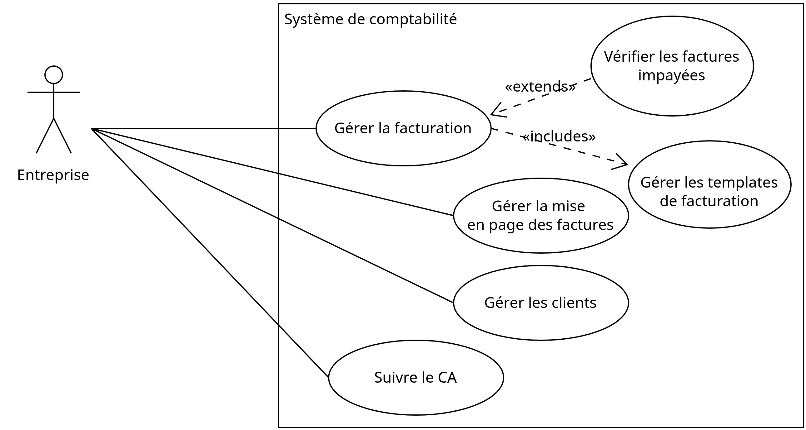

# Cahier des charges exemple

> Cahier des charges d'exemple d'un système de comptabilité

## Contexte 

De nombreuses solutions logicielles existent pour tenir la comptabilité d'une entreprise, notamment en ligne. Néanmoins, la plupart offrent de trop nombreux services et ne permettent pas de customiser facilement les templates des factures à éditer. D'autres sont payantes. Le client souhaite disposer d'un outil sur mesure, minimal, qui lui permet de gérer facilement ses factures sur sa machine, sans avoir besoin d'une connexion Internet. 

## Objectifs

- **Éditer, mettre en page, prévisualiser et imprimer des factures**. Ceci permettra d'éditer plus rapidement et efficacement des factures (moins d'erreurs, gestion automatique de la numérotation des factures). Le bénéfice pourra se mesurer au temps passé pour sortir une facture pour un client.
- **Constituer une base de données des clients**. Le bénéfice sera de gagner du temps à l'édition de la facture, suivre facilement et éditer les coordonnées des clients.
- **Suivre le statut des factures**. Le bénéfice sera de déterminer rapidement quelles factures sont impayées afin d'effectuer des relances si nécessaire.
- **Suivre le chiffre d'affaires cumulé**. Accéder facilement au CA permettra de s'assurer plus régulièrement de l'atteinte d'objectifs de revenus mensuels, et de prendre des décisions plus facilement (accepter ou non une nouvelle mission, etc.)

## Acteurs

Un seul acteur

- Entreprise (1 seul rôle)

## Périmètre et cas d'utilisation

## Règles métier

- La numérotation des factures doit être continue.
- La facture doit indiquer les coordonnées du fournisseur et du client.
- La facture doit indiquer si la TVA est applicable, le montant total hors-taxe (HT) et toutes taxes comprises (TTC).
- La facture doit être datée.
- La facture doit avoir un numéro de version.

## Description des cas d'utilisation

### Description textuelle du cas d'utilisation principal

### Description textuelle du scénario "L'entreprise édite une facture pour École d'informatique suite à une prestation de jury"

## Exigences fonctionnelles

Voici la **liste priorisée** des exigences fonctionnelles du système :

- Le système doit permettre d'éditer une nouvelle facture en choisissant un modèle de facture préenregistrée, un client et les montants des prestations. 
- Le système doit gérer automatiquement la numérotation des factures.
- Le système doit proposer un modèle de facturation par défaut ainsi que la possibilité de charger de nouveaux modèles. Un modèle est défini par un ensemble de colonnes (libellé) et de lignes de facturation (une ou plusieurs).
- Le système doit toujours imprimer des factures indiquant la date d'émission, un numéro de facture valide, les coordonnées fournisseurs, les coordonnées du client, l'application ou non de la TVA, le montant total HT et TTC. Le système doit calculer le montant total HT et TTC.
- Le système doit permettre d'imprimer ou de réimprimer une facture au format PDF.
- Dans le cas où le client n'est pas encore connu du système, il doit permettre de l'ajouter.
- Le système doit permettre à l'utilisateur de gérer ses coordonnées.
- Le système doit permettre de prévisualiser la facture à imprimer dans le navigateur web.
- Le système doit suivre le paiement des factures. Une facture peut être dans l'un des deux états suivants : payée ou impayée. Une facture imprimée est dans l'état impayée par défaut. Dans le cas où une facture émise est payée, le système doit permettre d'indiquer que la facture est payée.
- Le système doit permettre de lister facilement les factures par date d'émission et par statut. Dans le cas où une facture est impayée depuis une certaine période, définie par l'utilisateur en semaines (période entre dates actuelle et date d'émission supérieure à période de relance), le système doit l'indiquer clairement à l'utilisateur.
- Le système doit permettre d'éditer facilement la mise en page (fonts, marges, couleurs, logo, etc.) des factures à imprimer via une feuille de style.
- Le système doit permettre d'ajouter, d'éditer ou de supprimer un client dans une base de données intégrée au système. Dans le cas où l'utilisateur crée une nouvelle facture, le système doit fournir la liste des clients déjà enregistrés. Les coordonnées obligatoires d'un client sont les suivantes : nom ou raison sociale, adresse, SIRET, e-mail, téléphone.
- Le système doit permettre de visualiser le chiffre d'affaires brut (argent encaissé) et une estimation du net (chiffre d'affaires après paiement des cotisations URSSAF). Le système doit présenter le chiffre d'affaires sur une période définie par l'utilisateur : total (depuis la création), annuel (par année), mensuel (par mois). Pour évaluer le net, l'utilisateur pourra rentrer une estimation du pourcentage des cotisations sociales.

## Exigences *non fonctionnelles*

- Le système doit être simple à installer.
- Le système doit être simple à utiliser.
- Le système doit être simple à sauvegarder (dupliquer, backup) et à déplacer d'une machine à l'autre.
- Les données enregistrées et manipulées par le système (facturation, CA, coordonées fournisseur, coordonnées client) doivent être dans un format libre et standardisé afin de les rendre interoprables.

## Contraintes 

- Le système doit être accessible sans connexion Internet;
- Toutes les factures éditées et les informations des clients doivent être accessibles dans un format standard et facilement éditables avec un simple éditeur de texte. Les données seront conservées au format XML (interopérabilité) et disposeront d'un schéma afin de les valider automatiquement;
- Les factures doivent être imprimées au format PDF;
- Le système doit être accessible via n'importe quel navigateur web.

## Prestations attendues

## Annexes

### Dictionnaire des données

### Stack technique 

La solution sera basée sur les technologies du web (PHP, HTML, CSS/JS). Les documents et les informations clients seront conservés dans des fichiers XML, avec un schéma défini pour chaque document (facture, fiche client).