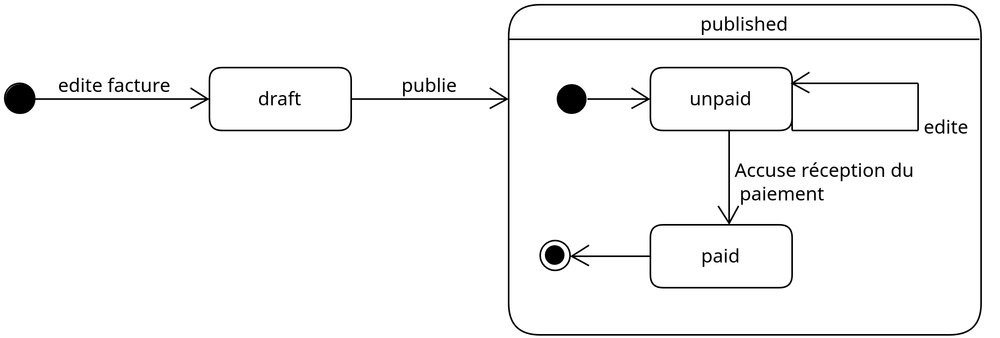

# Cahier des charges exemple

> Cahier des charges d'exemple d'un système de comptabilité

- [Cahier des charges exemple](#cahier-des-charges-exemple)
  - [Contexte](#contexte)
  - [Objectifs](#objectifs)
  - [Acteurs](#acteurs)
  - [Périmètre et cas d'utilisation](#périmètre-et-cas-dutilisation)
  - [Règles métier](#règles-métier)
  - [Description textuel du cas d'utilisation principal :  Éditer une nouvelle facture](#description-textuel-du-cas-dutilisation-principal---éditer-une-nouvelle-facture)
    - [Identification](#identification)
    - [Flux d'évènements](#flux-dévènements)
      - [Enchaînement nominal](#enchaînement-nominal)
      - [Enchaînements alternatifs](#enchaînements-alternatifs)
      - [Enchaînements d'exceptions](#enchaînements-dexceptions)
    - [Post-conditions](#post-conditions)
  - [Description textuelle du scénario "L'entreprise édite une facture pour le client existant "École d'informatique" suite à deux prestations de jury le 03/02/23 et le 04/02/23 pour un montant de 300 EUROS"](#description-textuelle-du-scénario-lentreprise-édite-une-facture-pour-le-client-existant-école-dinformatique-suite-à-deux-prestations-de-jury-le-030223-et-le-040223-pour-un-montant-de-300-euros)
    - [Identification](#identification-1)
    - [Déroulement](#déroulement)
  - [Exigences fonctionnelles](#exigences-fonctionnelles)
  - [Exigences *non fonctionnelles*](#exigences-non-fonctionnelles)
  - [Contraintes](#contraintes)
  - [Prestations attendues](#prestations-attendues)
  - [Annexes](#annexes)
    - [Planning](#planning)
      - [Itération 1](#itération-1)
    - [Installation](#installation)
      - [Développeur·se](#développeurse)
      - [Utilisateur·se](#utilisateurse)
    - [Dictionnaire des données](#dictionnaire-des-données)
    - [Documentation technique](#documentation-technique)
      - [Diagramme d'états/transitions d'une facture](#diagramme-détatstransitions-dune-facture)
    - [Stack technique](#stack-technique)

## Contexte 

De nombreuses solutions logicielles existent pour tenir la comptabilité d'une entreprise, notamment en ligne. Néanmoins, la plupart offrent de trop nombreux services et ne permettent pas de customiser facilement les templates des factures à éditer. D'autres sont payantes. Le client souhaite disposer d'un outil sur mesure, minimal, qui lui permet de gérer facilement ses factures sur sa machine, sans avoir besoin d'une connexion Internet. 

## Objectifs

- **Éditer, mettre en page, prévisualiser et imprimer des factures**. Ceci permettra d'éditer plus rapidement et efficacement des factures (moins d'erreurs, gestion automatique de la numérotation des factures). Le bénéfice pourra se mesurer au temps passé pour sortir une facture pour un client.
- **Constituer une base de données des clients**. Le bénéfice sera de gagner du temps à l'édition de la facture, suivre facilement et éditer les coordonnées des clients.
- **Suivre le statut des factures**. Le bénéfice sera de déterminer rapidement quelles factures sont impayées afin d'effectuer des relances si nécessaire.
- **Suivre le chiffre d'affaires cumulé**. Accéder facilement au CA permettra de s'assurer plus régulièrement de l'atteinte d'objectifs de revenus mensuels, et de prendre des décisions plus facilement (accepter ou non une nouvelle mission, etc.)

## Acteurs

Un seul acteur

- Entreprise (1 seul rôle)

## Périmètre et cas d'utilisation

## Règles métier

- La numérotation des factures doit être continue.
- La facture doit indiquer les coordonnées du fournisseur et du client.
- La facture doit indiquer si la TVA est applicable, le montant total hors-taxe (HT) et toutes taxes comprises (TTC).
- La facture doit être datée.
- La facture doit avoir un numéro de version.

## Description textuel du cas d'utilisation principal :  Éditer une nouvelle facture

### Identification

But: Ce processus consiste à créer et publier une facture.

Acteur principal : Entreprise

Date de création : 11/05/23

Date de dernière mise à jour 11/05/23

Responsable : Paul Schuhmacher

Version : 1.0

### Flux d'évènements

Le processus de gestion de facture commence lorsque l'utilisateur accède au système.

#### Enchaînement nominal

1. L'utilisateur demande la création d'une nouvelle facture. 
2. Le système lui propose un formulaire où l'utilisateur doit renseigner les coordonnées du client. Le système propose la liste des clients déjà enregistrés
3. L'utilisateur choisit un client
4. L'utilisateur choisit un modèle de facturation
5. L'utilisateur remplit les champs du modèle de facturation, ligne par ligne
6. Le système calcule le montant total HT et TTC,
7. L'utilisateur prévisualise la facture à imprimer
8. L'utilisateur publie la facture
9. Le système récupère le numéro de la dernière facture publiée. Il incrémente le numéro de facture et l'ajoute à la facture. 
10. Le système ajoute un numéro de version. 
11. Le système ajoute la date d'émission (date courante)
12. Le système charge la feuille de style et imprime la facture au format PDF en suivant le formatage du nom spécifié. La facture passe au statut imprimée et impayée.
13. Le système indique à l'utilisateur que la facture a été imprimée.
14. Le système conduit l'utilisateur au listing des factures imprimées

#### Enchaînements alternatifs

3A. Le client n'existe pas dans la base de données du système.
4. L'utilisateur choisit d'ajouter un client.
5. Le système propose un formulaire pour enregistrer un nouveau client. L'utilisateur renseigne les champs obligatoires suivantes : nom, prénom ou raison sociale, adresse, e-mail, numéro de téléphone, SIRET, label.
6. L'utilisateur enregistre le nouveau client.
7. Le système ramène l'utilisateur sur l'édition de la facture avec le client nouvellement créé sélectionné.

4. Le modèle désiré n'existe pas :
   1. Soit l'utilisateur annule. Sa facture est conservée en l'état au statut brouillon. La séquence reprend en 14.
   2. Soit l'utilisateur choisit le modèle par défaut. La séquence reprend en 5.

#### Enchaînements d'exceptions

9E : le système ne peut pas accéder au dernier numéro de facturation. Le système l'indique à l'utilisateur. Soit l'utilisateur annule. La séquence reprend en 14. Soit l'utilisateur choisit de renseigner manuellement le numéro de facture.

12E : le système ne peut pas accéder à la feuille de style. Le système l'indique à l'utilisateur. L'utilisateur annule, sa facture est conservée en l'état en mode brouillon. La séquence reprend en 14.

### Post-conditions

- Le système a créé deux fichiers: un fichier au format XML contenant les sources de la facture, un fichier au format PDF correspondant à l'impression de la facture, distribuable par l'entreprise.
- Le système à log la création de la facture (date, identifiant du client, numéro de la facture publiée) dans un fichier de journalisation

## Description textuelle du scénario "L'entreprise édite une facture pour le client existant "École d'informatique" suite à deux prestations de jury le 03/02/23 et le 04/02/23 pour un montant de 300 EUROS"

### Identification

But: Ce processus consiste à créer et publier une facture.

Acteur principal : Entreprise

Date de création : 11/05/23

Date de dernière mise à jour 11/05/23

Responsable : Paul Schuhmacher

Version : 1.0

### Déroulement

1. L'utilisateur demande la création d'une nouvelle facture. 
2. Le système lui propose un formulaire où l'utilisateur doit renseigner les coordonnées du client. Le système propose la liste des clients déjà enregistrés.
3. L'utilisateur choisit le client labélisé "École informatique"
4. L'utilisateur choisit le modèle de facturation "Jury"
5. L'utilisateur remplit les champs du modèle "Jury", une ligne par jury. Il renseigne la désignation, la date et le montant de chaque intervention (150 et 150)
6. Le système calcule le montant total HT de 300 EUROS et TTC de 300 EUROS (la TVA n'est pas applicable)
7. L'utilisateur prévisualise la facture à imprimer
8. L'utilisateur publie la facture
9. Le système récupère le numéro 12, numéro de la dernière facture publiée. Il incrémente le numéro de facture à 13 et ajoute le numéro 2023-0012 à la facture dans le champ "Numéro de facture".
10. Le système ajoute un numéro de version "1.0" 
11. Le système ajoute la date d'émission 11/05/23
12. Le système charge la feuille de style principale style.xslt et imprime la facture au format PDF dans le fichier 2023-0012.pdf. La facture passe au statut imprimé et impayé.
13. Le système indique à l'utilisateur que la facture 2023-0012.pdf a été imprimée.
14. Le système conduit l'utilisateur au listing des factures imprimées.

## Exigences fonctionnelles

Voici la **liste priorisée** des exigences fonctionnelles du système :

- Le système doit permettre d'éditer une nouvelle facture en choisissant un modèle de facture préenregistrée, un client et les montants des prestations. 
- Le système doit gérer automatiquement la numérotation des factures.
- Le système doit proposer un modèle de facturation par défaut 
- Le système doit permettre de définir et charger de nouveaux modèles. Un modèle est défini par un ensemble de colonnes (libellé) et de lignes de facturation (une ou plusieurs).
- Le système doit toujours imprimer des factures indiquant la date d'émission, un numéro de facture valide, les coordonnées fournisseurs, les coordonnées du client, l'application ou non de la TVA, le montant total HT et TTC. Le système doit calculer le montant total HT et TTC.
- Le système doit permettre d'imprimer ou de réimprimer une facture au format PDF.
- Dans le cas où le client n'est pas encore connu du système, il doit permettre de l'ajouter.
- Le système doit permettre à l'utilisateur de gérer ses coordonnées.
- Le système doit permettre de prévisualiser la facture à imprimer dans le navigateur web.
- Le système doit suivre l'édition des factures. Une facture peut être dans les deux états suivants : brouillon ou publiée. Une facture publiée met à jour le dernier numéro de facture.
- Le système doit suivre le paiement des factures. Une facture peut être dans l'un des deux états suivants : payée ou impayée. Une facture imprimée est dans l'état impayée par défaut. Dans le cas où une facture émise est payée, le système doit permettre d'indiquer que la facture est payée.
- Dans le cas où une facture est dans le statut publiée, le système interdit de la passer au statut brouillon. Le système ne peut attribuer le statut payé ou impayé qu'à une facture dans l'état publiée.
- Le système doit permettre de lister facilement les factures par date d'émission et par statut. Dans le cas où une facture est impayée depuis une certaine période, définie par l'utilisateur en semaines (période entre dates actuelle et date d'émission supérieure à période de relance), le système doit l'indiquer clairement à l'utilisateur.
- Le système doit permettre d'éditer facilement la mise en page (fonts, marges, couleurs, logo, etc.) des factures à imprimer via une feuille de style.
- Le système doit permettre d'ajouter, d'éditer ou de supprimer un client dans une base de données intégrée au système. Dans le cas où l'utilisateur crée une nouvelle facture, le système doit fournir la liste des clients déjà enregistrés. Les coordonnées obligatoires d'un client sont les suivantes : nom ou raison sociale, adresse, SIRET, e-mail, téléphone.
- Le système doit permettre de visualiser le chiffre d'affaires brut (argent encaissé) et une estimation du net (chiffre d'affaires après paiement des cotisations URSSAF). Le système doit présenter le chiffre d'affaires sur une période définie par l'utilisateur : total (depuis la création), annuel (par année), mensuel (par mois). Pour évaluer le net, l'utilisateur pourra rentrer une estimation du pourcentage des cotisations sociales.

## Exigences *non fonctionnelles*

- Le système doit être simple à installer.
- Le système doit être simple à utiliser.
- Le système doit être simple à sauvegarder (dupliquer, backup) et à déplacer d'une machine à l'autre.
- Les données enregistrées et manipulées par le système (facturation, CA, coordonnées fournisseurs, coordonnées client) doivent être dans un format libre et standardisé afin de les rendre interopérables.

## Contraintes 

- Le système doit être **accessible sans connexion Internet**;
- **Interopérabilité des données** : toutes les factures éditées et les informations des clients doivent être accessibles dans un format standard et facilement éditables avec un simple éditeur de texte. Les données seront conservées au format XML et disposeront d'un schéma afin de les valider automatiquement;
- Les factures doivent être imprimées au **format PDF**;
- Le système doit être **accessible via n'importe quel navigateur web**.
- Le système doit fonctionner sur tous les sytèmes UNIX-like (GNU/Linux, macOS) et sur Windows avec WSL (Windows Subsystem for Linux)

## Prestations attendues

## Annexes

### Planning

#### Itération 1

Date de livraison : 19/06/23

Contenu : 

- Le système doit permettre d'éditer une nouvelle facture en choisissant un modèle de facture préenregistrée, un client et les montants des prestations. 
- Le système doit gérer automatiquement la numérotation des factures.
- Le système doit proposer un modèle de facturation par défaut 

### Installation

#### Développeur·se

Voir le README du dépôt hébergeant le code source.

#### Utilisateur·se

Voir le manuel manuel.pdf hébergé à cette adresse.

### Dictionnaire des données

> A compléter.

|  Code 	| Désignation  	| Type   	|  Taille 	|  Remarque 	|
|---	|---	|---	|---	|---	|
|  `statut_edition` 	|   État d'une facture dans le processus éditorial. 2 statuts possibles: brouillon, publiée	|  A 	|  10 	|   Lorsqu'une facture est publiée, elle ne peut plus passer dans le statut brouillon.	|
|   `draft`	|   Statut éditorial d'une facture en attente d'impression	|   A	|   10	|   	|
|   `printed`	|   Statut éditorial d'une facture imprimée	|   A	|   10	|   	|
|   `statut_payment`	| Statut de paiement d'une facture. 2 statuts possibles: impayée, payée  	|   A	|  10 	|  Une facture payée ne peut pas passer en état impayée. Seule une facture publiée peut avoir un statut de paiement. Une facture dans l'état brouillon a un statut de paiement indéfini. 	|
|  `payment_extension_in_weeks` 	|  Le délai d'attente accepté par l'entreprise exprimé en semaines avant d'effectuer une relance auprès du client 	|   N	|   	|   	|
|   `id_client`	| L'identifiant unique d'un client  	|  N 	|   	|   	|
|   `id_invoice`	| L'identifiant unique d'une facture	|  N 	|   	|   	|
|   `number_invoice`	| Le numéro unique d'une facture	|  AN 	|   14	|  Contient l'identifiant unique d'une facture. Au format spécifié par l'utilisateur. Par défaut `YYYY-XXXX` où `YYYY` est l'année courante, `XXXX` l'identifiant de la facture. 	|

### Documentation technique

#### Diagramme d'états/transitions d'une facture

Ce diagramme aide à visualiser les différents états que peut posséder une facture au cours de son cycle de vie.

### Stack technique 

La solution sera basée sur les technologies du web (PHP, HTML, CSS/JS). Les documents et les informations clients sont conservés dans des fichiers XML, avec un schéma défini pour chaque document (facture, fiche client). Les feuilles de style sont au format XLST.